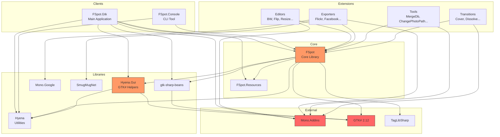
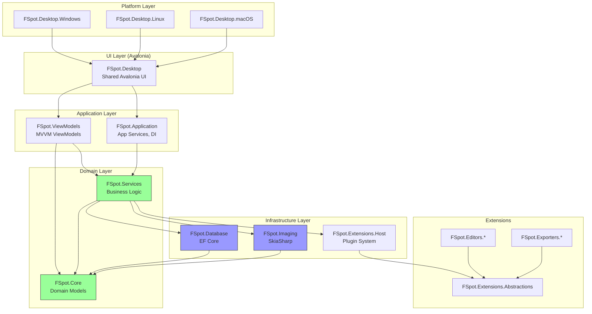
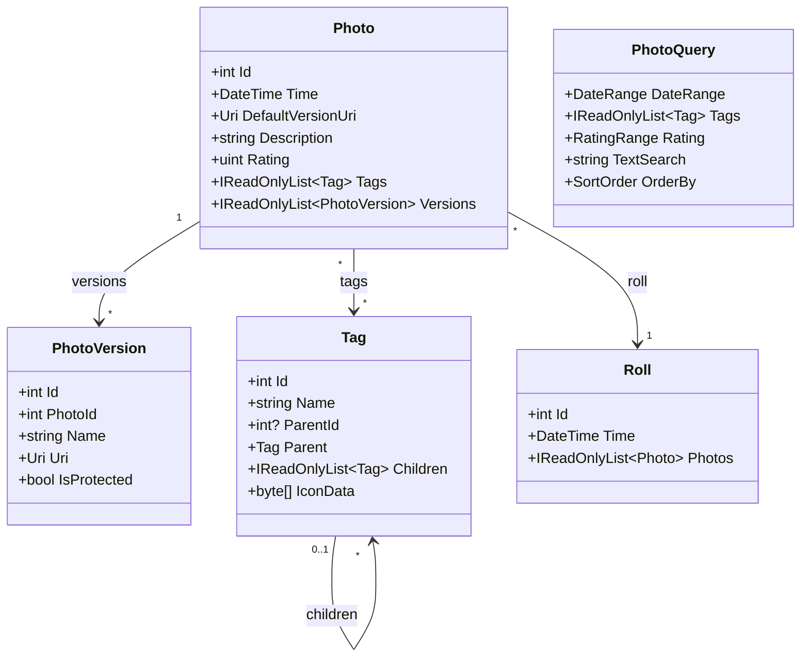
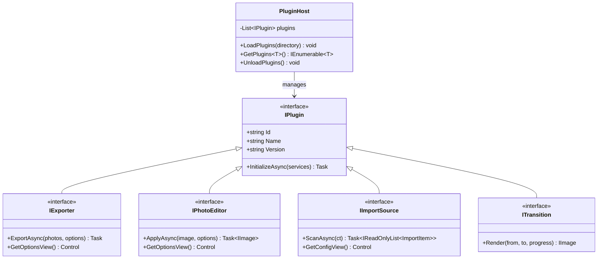

# F-Spot Architecture

This document describes the current and target architecture for the F-Spot photo management application.

---

## Table of Contents

1. [Current Architecture](#current-architecture)
2. [Target Architecture](#target-architecture)
3. [Component Details](#component-details)
4. [Data Flow](#data-flow)
5. [Database Schema](#database-schema)
6. [Migration Path](#migration-path)

---

## Current Architecture

### High-Level Overview

```
┌─────────────────────────────────────────────────────────────────────────────┐
│                              F-Spot Application                              │
├─────────────────────────────────────────────────────────────────────────────┤
│  ┌─────────────────────────────────────────────────────────────────────┐   │
│  │                     Presentation Layer (GTK#)                        │   │
│  │  ┌──────────────┐  ┌──────────────┐  ┌──────────────────────────┐   │   │
│  │  │ Main Window  │  │   Dialogs    │  │   Extension UIs          │   │   │
│  │  │ (FSpot.Gtk)  │  │              │  │   (Mono.Addins)          │   │   │
│  │  └──────────────┘  └──────────────┘  └──────────────────────────┘   │   │
│  └─────────────────────────────────────────────────────────────────────┘   │
│                                    │                                        │
│                                    ▼                                        │
│  ┌─────────────────────────────────────────────────────────────────────┐   │
│  │                        Core Library (FSpot)                          │   │
│  │  ┌────────────┐  ┌────────────┐  ┌────────────┐  ┌──────────────┐   │   │
│  │  │  Imaging   │  │ Thumbnails │  │  Database  │  │    Query     │   │   │
│  │  │ (Gdk.Pixbuf)│ │ (Gdk.Pixbuf)│ │(Hyena.Sqlite)│ │              │   │   │
│  │  └────────────┘  └────────────┘  └────────────┘  └──────────────┘   │   │
│  │  ┌────────────┐  ┌────────────┐  ┌────────────┐  ┌──────────────┐   │   │
│  │  │   Import   │  │  Settings  │  │ FileSystem │  │  JobScheduler│   │   │
│  │  └────────────┘  └────────────┘  └────────────┘  └──────────────┘   │   │
│  │  ┌─────────────────────────────────────────────────────────────┐    │   │
│  │  │              GUI Widgets (21 GTK# widgets)                   │    │   │
│  │  │              ⚠️ PROBLEM: Should be in Presentation Layer     │    │   │
│  │  └─────────────────────────────────────────────────────────────┘    │   │
│  └─────────────────────────────────────────────────────────────────────┘   │
│                                    │                                        │
│                                    ▼                                        │
│  ┌─────────────────────────────────────────────────────────────────────┐   │
│  │                      Shared Libraries (lib/)                         │   │
│  │  ┌────────────────┐  ┌────────────────┐  ┌──────────────────────┐   │   │
│  │  │     Hyena      │  │   Hyena.Gui    │  │   gtk-sharp-beans    │   │   │
│  │  │  (utilities)   │  │  (GTK# helpers)│  │  (extended bindings) │   │   │
│  │  └────────────────┘  └────────────────┘  └──────────────────────┘   │   │
│  └─────────────────────────────────────────────────────────────────────┘   │
│                                    │                                        │
│                                    ▼                                        │
│  ┌─────────────────────────────────────────────────────────────────────┐   │
│  │                         External Dependencies                        │   │
│  │  ┌────────────┐  ┌────────────┐  ┌────────────┐  ┌──────────────┐   │   │
│  │  │  GTK# 2.12 │  │ Mono.Addins│  │ TagLibSharp│  │   Serilog    │   │   │
│  │  └────────────┘  └────────────┘  └────────────┘  └──────────────┘   │   │
│  └─────────────────────────────────────────────────────────────────────┘   │
└─────────────────────────────────────────────────────────────────────────────┘
```

### Current Project Dependencies



### Current Issues

| Issue | Location | Impact |
|-------|----------|--------|
| GTK# in Core | `FSpot/Imaging/`, `FSpot/Thumbnail/` | Blocks migration |
| Pixbuf in Domain | `FSpot/Core/Tag.cs` | Leaky abstraction |
| Widgets in Core | `FSpot/Gui/FSpot.Widgets/` | Layer violation |
| Mono.Addins | Extensions system | Mono-specific |
| Hyena.Data.Sqlite | Database layer | Mono-specific |

---

## Target Architecture

### High-Level Overview

```
┌─────────────────────────────────────────────────────────────────────────────┐
│                         F-Spot Modern Architecture                           │
├─────────────────────────────────────────────────────────────────────────────┤
│                                                                              │
│  ┌─────────────────────────────────────────────────────────────────────┐    │
│  │                    Platform Clients (Avalonia)                       │    │
│  │  ┌──────────────┐  ┌──────────────┐  ┌──────────────────────────┐   │    │
│  │  │    Linux     │  │   Windows    │  │        macOS             │   │    │
│  │  │  (Desktop)   │  │  (Desktop)   │  │      (Desktop)           │   │    │
│  │  └──────────────┘  └──────────────┘  └──────────────────────────┘   │    │
│  └─────────────────────────────────────────────────────────────────────┘    │
│                                    │                                         │
│                                    ▼                                         │
│  ┌─────────────────────────────────────────────────────────────────────┐    │
│  │                      Shared Avalonia UI Layer                        │    │
│  │  ┌────────────┐  ┌────────────┐  ┌────────────┐  ┌──────────────┐   │    │
│  │  │   Views    │  │  Controls  │  │  Dialogs   │  │   Themes     │   │    │
│  │  │   (XAML)   │  │  (Custom)  │  │            │  │              │   │    │
│  │  └────────────┘  └────────────┘  └────────────┘  └──────────────┘   │    │
│  └─────────────────────────────────────────────────────────────────────┘    │
│                                    │                                         │
│                                    ▼                                         │
│  ┌─────────────────────────────────────────────────────────────────────┐    │
│  │                      Application Layer (Shared)                      │    │
│  │  ┌────────────────────────────┐  ┌──────────────────────────────┐   │    │
│  │  │       ViewModels           │  │      Application Services    │   │    │
│  │  │  (CommunityToolkit.Mvvm)   │  │    (DI, Navigation, etc.)    │   │    │
│  │  └────────────────────────────┘  └──────────────────────────────┘   │    │
│  └─────────────────────────────────────────────────────────────────────┘    │
│                                    │                                         │
│                                    ▼                                         │
│  ┌─────────────────────────────────────────────────────────────────────┐    │
│  │                         Core Domain Layer                            │    │
│  │  ┌────────────┐  ┌────────────┐  ┌────────────┐  ┌──────────────┐   │    │
│  │  │   Domain   │  │  Services  │  │ Interfaces │  │    Events    │   │    │
│  │  │   Models   │  │            │  │            │  │              │   │    │
│  │  └────────────┘  └────────────┘  └────────────┘  └──────────────┘   │    │
│  └─────────────────────────────────────────────────────────────────────┘    │
│                                    │                                         │
│                                    ▼                                         │
│  ┌─────────────────────────────────────────────────────────────────────┐    │
│  │                      Infrastructure Layer                            │    │
│  │  ┌────────────┐  ┌────────────┐  ┌────────────┐  ┌──────────────┐   │    │
│  │  │  Database  │  │  Imaging   │  │ FileSystem │  │  Extensions  │   │    │
│  │  │ (EF Core)  │  │(SkiaSharp) │  │            │  │  (Plugins)   │   │    │
│  │  └────────────┘  └────────────┘  └────────────┘  └──────────────┘   │    │
│  └─────────────────────────────────────────────────────────────────────┘    │
│                                    │                                         │
│                                    ▼                                         │
│  ┌─────────────────────────────────────────────────────────────────────┐    │
│  │                       External Dependencies                          │    │
│  │  ┌────────────┐  ┌────────────┐  ┌────────────┐  ┌──────────────┐   │    │
│  │  │ Avalonia   │  │ SkiaSharp  │  │  EF Core   │  │ TagLibSharp  │   │    │
│  │  └────────────┘  └────────────┘  └────────────┘  └──────────────┘   │    │
│  └─────────────────────────────────────────────────────────────────────┘    │
│                                                                              │
└─────────────────────────────────────────────────────────────────────────────┘
```

### Target Project Structure



### Layer Responsibilities

```
┌─────────────────────────────────────────────────────────────────────────┐
│                              LAYER DIAGRAM                               │
├─────────────────────────────────────────────────────────────────────────┤
│                                                                          │
│   ┌──────────────────────────────────────────────────────────────────┐  │
│   │  PLATFORM LAYER                                                   │  │
│   │  ────────────────                                                 │  │
│   │  • Platform-specific startup (Program.cs)                         │  │
│   │  • Native integrations (system tray, file associations)          │  │
│   │  • Platform DI registrations                                      │  │
│   │                                                                   │  │
│   │  Projects: FSpot.Desktop.{Windows,Linux,macOS}                   │  │
│   └──────────────────────────────────────────────────────────────────┘  │
│                                 │                                        │
│                                 ▼                                        │
│   ┌──────────────────────────────────────────────────────────────────┐  │
│   │  UI LAYER                                                         │  │
│   │  ────────────                                                     │  │
│   │  • Avalonia Views (XAML)                                          │  │
│   │  • Custom Controls                                                │  │
│   │  • Value Converters                                               │  │
│   │  • Styles and Themes                                              │  │
│   │                                                                   │  │
│   │  Projects: FSpot.Desktop                                          │  │
│   └──────────────────────────────────────────────────────────────────┘  │
│                                 │                                        │
│                                 ▼                                        │
│   ┌──────────────────────────────────────────────────────────────────┐  │
│   │  APPLICATION LAYER                                                │  │
│   │  ─────────────────────                                            │  │
│   │  • ViewModels (INotifyPropertyChanged)                            │  │
│   │  • Commands (ICommand, RelayCommand)                              │  │
│   │  • Navigation Service                                             │  │
│   │  • Dialog Service                                                 │  │
│   │  • Application State                                              │  │
│   │                                                                   │  │
│   │  Projects: FSpot.ViewModels, FSpot.Application                   │  │
│   └──────────────────────────────────────────────────────────────────┘  │
│                                 │                                        │
│                                 ▼                                        │
│   ┌──────────────────────────────────────────────────────────────────┐  │
│   │  DOMAIN LAYER (No external dependencies!)                         │  │
│   │  ─────────────────────────────────────────                        │  │
│   │  • Entity Models (Photo, Tag, Roll, etc.)                         │  │
│   │  • Value Objects (Rating, PhotoUri, etc.)                         │  │
│   │  • Domain Services                                                │  │
│   │  • Repository Interfaces                                          │  │
│   │  • Domain Events                                                  │  │
│   │                                                                   │  │
│   │  Projects: FSpot.Core, FSpot.Services                            │  │
│   └──────────────────────────────────────────────────────────────────┘  │
│                                 │                                        │
│                                 ▼                                        │
│   ┌──────────────────────────────────────────────────────────────────┐  │
│   │  INFRASTRUCTURE LAYER                                             │  │
│   │  ────────────────────────                                         │  │
│   │  • EF Core DbContext + Repositories                               │  │
│   │  • SkiaSharp Image Processing                                     │  │
│   │  • File System Operations                                         │  │
│   │  • Plugin Host                                                    │  │
│   │  • External API Clients                                           │  │
│   │                                                                   │  │
│   │  Projects: FSpot.Database, FSpot.Imaging, FSpot.Extensions.Host  │  │
│   └──────────────────────────────────────────────────────────────────┘  │
│                                                                          │
└─────────────────────────────────────────────────────────────────────────┘
```

---

## Component Details

### Core Domain Models



### Service Interfaces

```mermaid
classDiagram
    class IPhotoRepository {
        <<interface>>
        +GetByIdAsync(id) Task~Photo~
        +QueryAsync(query) Task~IReadOnlyList~Photo~~
        +AddAsync(photo) Task
        +UpdateAsync(photo) Task
        +DeleteAsync(photo) Task
    }

    class IImageLoader {
        <<interface>>
        +LoadAsync(uri) Task~IImage~
        +LoadThumbnailAsync(uri, size) Task~IImage~
    }

    class IThumbnailService {
        <<interface>>
        +GetThumbnailAsync(photo, size) Task~IImage~
        +GenerateThumbnailAsync(photo) Task
        +InvalidateThumbnail(photo) void
    }

    class IImportService {
        <<interface>>
        +ScanSourceAsync(path) Task~IReadOnlyList~ImportItem~~
        +ImportAsync(items, options) Task~ImportResult~
    }

    class IExportService {
        <<interface>>
        +GetExporters() IReadOnlyList~IExporter~
        +ExportAsync(photos, exporter, options) Task
    }

    class IImage {
        <<interface>>
        +int Width
        +int Height
        +Resize(w, h) IImage
        +Rotate(direction) IImage
        +AsStream(format) Stream
        +Dispose() void
    }
```



### Plugin System



---

## Data Flow

### Photo Import Flow

```
┌─────────────┐     ┌─────────────┐     ┌─────────────┐     ┌─────────────┐
│   User      │     │  ImportVM   │     │ImportService│     │  Database   │
│             │     │             │     │             │     │             │
└──────┬──────┘     └──────┬──────┘     └──────┬──────┘     └──────┬──────┘
       │                   │                   │                   │
       │  Select Folder    │                   │                   │
       │──────────────────>│                   │                   │
       │                   │                   │                   │
       │                   │  ScanSourceAsync  │                   │
       │                   │──────────────────>│                   │
       │                   │                   │                   │
       │                   │                   │  Read EXIF/XMP    │
       │                   │                   │  ─────────────    │
       │                   │                   │                   │
       │                   │  ImportItems[]    │                   │
       │                   │<──────────────────│                   │
       │                   │                   │                   │
       │  Show Preview     │                   │                   │
       │<──────────────────│                   │                   │
       │                   │                   │                   │
       │  Confirm Import   │                   │                   │
       │──────────────────>│                   │                   │
       │                   │                   │                   │
       │                   │  ImportAsync      │                   │
       │                   │──────────────────>│                   │
       │                   │                   │                   │
       │                   │                   │  Copy Files       │
       │                   │                   │  ─────────────    │
       │                   │                   │                   │
       │                   │                   │  Generate Thumbs  │
       │                   │                   │  ───────────────  │
       │                   │                   │                   │
       │                   │                   │  AddAsync(photos) │
       │                   │                   │──────────────────>│
       │                   │                   │                   │
       │                   │  ImportResult     │                   │
       │                   │<──────────────────│                   │
       │                   │                   │                   │
       │  Show Result      │                   │                   │
       │<──────────────────│                   │                   │
       │                   │                   │                   │
```

### Photo Viewing Flow

```
┌─────────────┐     ┌─────────────┐     ┌─────────────┐     ┌─────────────┐
│   User      │     │  PhotoVM    │     │ThumbnailSvc │     │ ImageLoader │
│             │     │             │     │             │     │             │
└──────┬──────┘     └──────┬──────┘     └──────┬──────┘     └──────┬──────┘
       │                   │                   │                   │
       │  Open Library     │                   │                   │
       │──────────────────>│                   │                   │
       │                   │                   │                   │
       │                   │  QueryAsync       │                   │
       │                   │  ─────────────    │                   │
       │                   │                   │                   │
       │                   │  GetThumbnails    │                   │
       │                   │──────────────────>│                   │
       │                   │                   │                   │
       │                   │                   │  Check Cache      │
       │                   │                   │  ───────────      │
       │                   │                   │                   │
       │                   │  IImage[]         │                   │
       │                   │<──────────────────│                   │
       │                   │                   │                   │
       │  Show Grid        │                   │                   │
       │<──────────────────│                   │                   │
       │                   │                   │                   │
       │  Click Photo      │                   │                   │
       │──────────────────>│                   │                   │
       │                   │                   │                   │
       │                   │  LoadAsync (full) │                   │
       │                   │──────────────────────────────────────>│
       │                   │                   │                   │
       │                   │                   │                   │  Decode
       │                   │                   │                   │  ──────
       │                   │                   │                   │
       │                   │  IImage (full)    │                   │
       │                   │<──────────────────────────────────────│
       │                   │                   │                   │
       │  Show Full View   │                   │                   │
       │<──────────────────│                   │                   │
       │                   │                   │                   │
```

---

## Database Schema

### Entity Relationship Diagram

```
┌─────────────────────────────────────────────────────────────────────────────┐
│                           F-Spot Database Schema                             │
├─────────────────────────────────────────────────────────────────────────────┤
│                                                                              │
│   ┌─────────────────┐         ┌─────────────────┐                           │
│   │     rolls       │         │     photos      │                           │
│   ├─────────────────┤         ├─────────────────┤                           │
│   │ PK id           │◄────────│ FK roll_id      │                           │
│   │    time         │         │ PK id           │                           │
│   └─────────────────┘         │    time         │                           │
│                               │    uri          │                           │
│                               │    description  │                           │
│                               │    rating       │                           │
│                               │    default_ver  │                           │
│                               └────────┬────────┘                           │
│                                        │                                     │
│                          ┌─────────────┴─────────────┐                      │
│                          │                           │                      │
│                          ▼                           ▼                      │
│   ┌─────────────────┐         ┌─────────────────┐                           │
│   │  photo_versions │         │   photo_tags    │                           │
│   ├─────────────────┤         ├─────────────────┤                           │
│   │ PK id           │         │ FK photo_id     │────────┐                  │
│   │ FK photo_id     │         │ FK tag_id       │        │                  │
│   │    name         │         └─────────────────┘        │                  │
│   │    uri          │                                    │                  │
│   │    protected    │                                    ▼                  │
│   │    import_md5   │         ┌─────────────────┐                           │
│   └─────────────────┘         │      tags       │                           │
│                               ├─────────────────┤                           │
│                               │ PK id           │◄──┐                       │
│                               │ FK category_id  │───┘ (self-reference)      │
│                               │    name         │                           │
│                               │    is_category  │                           │
│                               │    sort_priority│                           │
│                               │    icon         │                           │
│                               └─────────────────┘                           │
│                                                                              │
│   ┌─────────────────┐         ┌─────────────────┐                           │
│   │      jobs       │         │      meta       │                           │
│   ├─────────────────┤         ├─────────────────┤                           │
│   │ PK id           │         │ PK id           │                           │
│   │    job_type     │         │    name         │                           │
│   │    job_options  │         │    data         │                           │
│   │    run_at       │         └─────────────────┘                           │
│   │    job_priority │                                                       │
│   └─────────────────┘                                                       │
│                                                                              │
└─────────────────────────────────────────────────────────────────────────────┘
```

### EF Core Mapping

```csharp
// Simplified EF Core configuration
public class FSpotDbContext : DbContext
{
    public DbSet<Photo> Photos => Set<Photo>();
    public DbSet<PhotoVersion> PhotoVersions => Set<PhotoVersion>();
    public DbSet<Tag> Tags => Set<Tag>();
    public DbSet<Roll> Rolls => Set<Roll>();

    protected override void OnModelCreating(ModelBuilder modelBuilder)
    {
        // Map to existing table names (lowercase)
        modelBuilder.Entity<Photo>().ToTable("photos");
        modelBuilder.Entity<PhotoVersion>().ToTable("photo_versions");
        modelBuilder.Entity<Tag>().ToTable("tags");
        modelBuilder.Entity<Roll>().ToTable("rolls");

        // Many-to-many: photos <-> tags
        modelBuilder.Entity<Photo>()
            .HasMany(p => p.Tags)
            .WithMany()
            .UsingEntity(j => j.ToTable("photo_tags"));

        // Self-referencing: tag hierarchy
        modelBuilder.Entity<Tag>()
            .HasOne(t => t.Parent)
            .WithMany(t => t.Children)
            .HasForeignKey("category_id");
    }
}
```

---

## Migration Path

### Phase Overview

```
┌─────────────────────────────────────────────────────────────────────────────┐
│                          MIGRATION TIMELINE                                  │
├─────────────────────────────────────────────────────────────────────────────┤
│                                                                              │
│  Phase 1          Phase 2          Phase 3          Phase 4          Phase 5│
│  Weeks 1-8        Weeks 9-16       Weeks 17-24      Weeks 25-36      37-44  │
│                                                                              │
│  ┌──────────┐     ┌──────────┐     ┌──────────┐     ┌──────────┐     ┌─────┐│
│  │Foundation│────>│  Core    │────>│ Avalonia │────>│ Features │────>│Ship ││
│  │Abstracts │     │  .NET 10 │     │  Shell   │     │  Parity  │     │     ││
│  └──────────┘     └──────────┘     └──────────┘     └──────────┘     └─────┘│
│                                                                              │
│  • IImage         • SkiaSharp      • Main Window    • All Views      • Perf │
│  • IImageLoader   • EF Core        • Photo Grid     • Extensions     • i18n │
│  • IThumbnailSvc  • .NET 10        • Photo View     • Import/Export  • Pkg  │
│  • Adapters       • Move Widgets   • Sidebar        • Editing        • Docs │
│                                                                              │
│  ════════════════════════════════════════════════════════════════════════   │
│  │ GTK# App Still Works │  GTK# Deprecated  │    Avalonia Only    │         │
│  ════════════════════════════════════════════════════════════════════════   │
│                                                                              │
└─────────────────────────────────────────────────────────────────────────────┘
```

### Parallel Development Strategy

```
┌─────────────────────────────────────────────────────────────────────────────┐
│                     PARALLEL DEVELOPMENT STRATEGY                            │
├─────────────────────────────────────────────────────────────────────────────┤
│                                                                              │
│   Month 1-2                     Month 3-4                     Month 5+      │
│                                                                              │
│   ┌─────────────────────────────────────────────────────────────────────┐   │
│   │                         GTK# Application                             │   │
│   │   [═══════════════════] [═════════════] [───deprecated───]          │   │
│   │        Working              Working         Maintenance              │   │
│   └─────────────────────────────────────────────────────────────────────┘   │
│                                                                              │
│   ┌─────────────────────────────────────────────────────────────────────┐   │
│   │                      Abstraction Layer                               │   │
│   │   [─────building─────] [═══════════════════════════════════════]    │   │
│   │                              Stable                                  │   │
│   └─────────────────────────────────────────────────────────────────────┘   │
│                                                                              │
│   ┌─────────────────────────────────────────────────────────────────────┐   │
│   │                      Avalonia Application                            │   │
│   │                        [─────building─────] [═══════════════════]   │   │
│   │                                                   Primary            │   │
│   └─────────────────────────────────────────────────────────────────────┘   │
│                                                                              │
│   Legend: [═══] Active/Stable  [───] Building/Deprecated                    │
│                                                                              │
└─────────────────────────────────────────────────────────────────────────────┘
```

### Component Migration Order

```mermaid
graph LR
    subgraph Phase1["Phase 1: Abstractions"]
        A1[IImage Interface]
        A2[IImageLoader]
        A3[IThumbnailService]
        A4[Domain Cleanup]
    end

    subgraph Phase2["Phase 2: Core"]
        B1[SkiaSharp Backend]
        B2[EF Core Database]
        B3[.NET 10 Migration]
        B4[Move Widgets]
    end

    subgraph Phase3["Phase 3: UI"]
        C1[Avalonia Shell]
        C2[Photo Grid]
        C3[Photo Viewer]
        C4[Sidebar]
    end

    subgraph Phase4["Phase 4: Features"]
        D1[All Views]
        D2[Plugin System]
        D3[Extensions]
        D4[Platform Features]
    end

    A1 --> A2 --> A3 --> A4
    A4 --> B1
    B1 --> B2 --> B3 --> B4
    B4 --> C1
    C1 --> C2 --> C3 --> C4
    C4 --> D1
    D1 --> D2 --> D3 --> D4
```



---

## Appendix: Technology Comparison

### Image Libraries

| Feature | Gdk.Pixbuf | SkiaSharp | ImageSharp |
|---------|------------|-----------|------------|
| Cross-platform | Linux only | Yes | Yes |
| .NET Core/5+ | No (Mono) | Yes | Yes |
| GPU acceleration | No | Yes | No |
| Format support | Good | Excellent | Excellent |
| Performance | Moderate | Fast | Moderate |
| Native deps | Yes (GTK) | Yes (Skia) | None |
| **Recommendation** | | **Selected** | Fallback |

### Database Options

| Feature | Hyena.Data.Sqlite | EF Core | Dapper |
|---------|-------------------|---------|--------|
| Cross-platform | Mono only | Yes | Yes |
| LINQ support | Limited | Full | No |
| Migrations | Manual | Built-in | Manual |
| Performance | Good | Good | Excellent |
| Learning curve | Medium | Medium | Low |
| **Recommendation** | | **Selected** | |

### Extension Systems

| Feature | Mono.Addins | MEF | AssemblyLoadContext |
|---------|-------------|-----|---------------------|
| Cross-platform | Mono only | Yes | Yes |
| Hot reload | No | No | Yes (collectible) |
| Complexity | High | Medium | Low |
| Dependencies | Mono | None | None |
| **Recommendation** | | Alternative | **Selected** |
